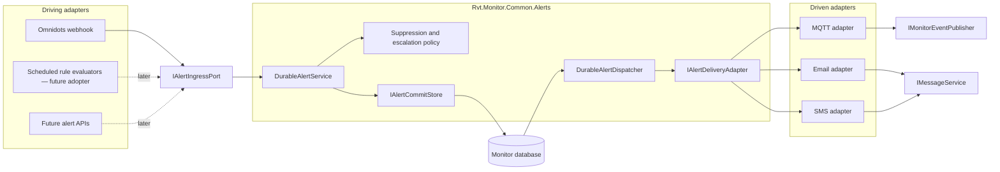
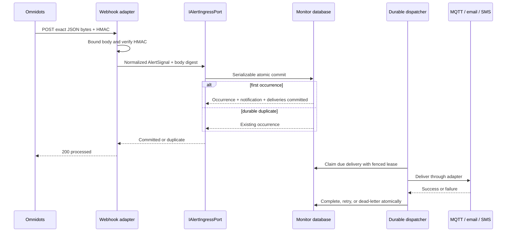

# Common Durable Alert Ingress and Omnidots Webhook Design

## Purpose

Eliminate the recurring Omnidots webhook P0 class rather than applying another endpoint-local patch. The design hardens the Omnidots HTTP boundary and moves reusable alert acceptance, persistence, and delivery into `Rvt.Monitor.Common.Alerts`.

The result is a generic hexagonal alert slice:

- Omnidots owns only vendor authentication, payload parsing, configuration, and translation.
- RVT Common owns alert acceptance, suppression and escalation, atomic persistence, durable delivery, retries, and cleanup.
- The Omnidots webhook is a driving adapter into the alert ingress port.
- MQTT, email, and SMS are driven delivery adapters behind a common delivery port.

This direction reuses the existing MQTT wire contract and the proven MyATM outbox reliability patterns without making the webhook depend on MQTT abstractions or immediately migrating other monitors.

## Scope

This work includes:

1. API-mode startup validation for Omnidots webhook and configuration secrets.
2. Fail-closed guards inside the handlers and signature validator.
3. Bounded, JSON-only HTTP request handling and exact raw-body HMAC verification.
4. A typed, fixed-time-authenticated measuring-point configuration endpoint.
5. A transport-neutral alert ingress port and application service in RVT Common.
6. Durable, duplicate-safe alert occurrence, notification, and delivery creation.
7. Shared MQTT, email, and SMS delivery adapters with fenced leases, retries, dead letters, and audits.
8. One-shot, API-worker, and Quartz execution paths for delivery dispatch.
9. PostgreSQL-first and SQL Server-compatible schema assets, tests, documentation, and rollout guidance.

## Non-goals

- Do not migrate AirQ, Svantek, or MyATM alert behavior in this P0 change.
- Do not remove the existing MyATM-specific outbox yet.
- Do not change `RvtMqttMessage`, MQTT topic names, or their serialized wire format.
- Do not claim exactly-once delivery from external email, SMS, or MQTT providers.
- Do not store webhook request bodies, signatures, or secrets in alert tables, audits, or logs.
- Do not expand a monitor's broad `IDBClient` for new alert behavior; it remains a compatibility facade.

## Architectural Decision

The webhook is an inbound adapter, not an implementation of `IMonitorEventPublisher`. Treating it as a publisher would reverse the port direction and couple Omnidots authentication and JSON parsing to an MQTT-shaped output contract.

Instead, the webhook authenticates and translates the vendor request, then invokes `IAlertIngressPort`. The common application service performs the atomic domain operation. Delivery happens later through `IAlertDeliveryAdapter` implementations. The MQTT adapter delegates to the existing `IMonitorEventPublisher.PublishAlertAsync`, preserving the current `RvtMqttMessage` wire format.

## Common Alert Contracts

Create an `Rvt.Monitor.Common.Alerts` slice with contracts that contain no Omnidots JSON or signature concepts.

### Alert ingress

`AlertSignal` carries the normalized facts needed by the common service:

- source name and source event key;
- source event time;
- monitor serial ID;
- normalized `Ignore`, `Caution`, or `Alert` severity;
- alert field, measured level, threshold, and averaging period;
- a safe display message for MQTT;
- requested delivery channels; and
- the configured suppression window.

The source event key is an opaque stable key. For Omnidots it is the lowercase SHA-256 digest of the exact authenticated request bytes. Common hashes the source event key before persistence and never receives the raw body or signature.

`IAlertIngressPort.AcceptAsync(AlertSignal, CancellationToken)` returns a small result that distinguishes a newly committed occurrence from a durable duplicate. It does not expose contacts, destinations, provider errors, or stored payloads to the HTTP adapter.

### Policy

The common suppression and escalation policy uses event time, not processing time:

- `Ignore` records an ignored occurrence and creates no notification or delivery.
- A caution is accepted only if no caution or alert exists for the monitor in `[event time - suppression window, event time]`.
- An alert is accepted if the window is empty or contains caution without alert.
- An alert is suppressed if the window already contains an alert.
- An accepted alert never closes or downgrades an earlier notification.

The policy is pure and directly unit tested. A future adopter can supply a different `IAlertAcceptancePolicy`; Omnidots uses the standard caution-to-alert escalation policy.

### Persistence port

`IAlertCommitStore` is the narrow application-facing persistence port. A generic EF implementation works against `MonitorDbContextBase` through a concrete monitor context factory. Monitor composition roots register the concrete context and common alert services; application handlers do not reach through `IDBClient`.

`MonitorDbContextBase` owns the shared entity mappings and DbSets for alert occurrences and delivery outbox messages, alongside its existing shared notification and notification-audit mappings.

## Atomic Acceptance and Duplicate Handling

`DurableAlertService` processes one signal in a serializable database transaction:

1. Validate the normalized signal and calculate the 32-byte source-key hash.
2. Derive the notification ID deterministically from the fixed Common alert namespace plus source and source-key hash.
3. Insert an occurrence protected by a unique `(source, source_key_hash)` constraint.
4. Resolve the deployed monitor and evaluate the common suppression/escalation policy.
5. Record the occurrence outcome as `Accepted`, `Ignored`, or `Suppressed`.
6. For an accepted occurrence, insert the existing shared `NotificationEntity`.
7. Resolve contacts and create one unique delivery for MQTT plus one for each enabled email and SMS destination requested by the signal.
8. Commit the occurrence, notification, and complete delivery set together.

The deterministic notification ID uses the first 128 bits of SHA-256 over a fixed, documented Common namespace, source, and source-key hash, with the RFC 9562 version-8 and variant bits set. This avoids introducing SHA-1 merely to create a stable UUID. It is an identity mechanism, not an authentication mechanism.

If a concurrent request wins the occurrence insert, the losing transaction reads the committed occurrence and returns it as a duplicate. A rolled-back first attempt leaves no occurrence, notification, or deliveries, so a retry can become the winner. No raw request material is needed for this decision.

The exact guarantee is:

- one committed occurrence for one source and exact authenticated body;
- at most one shared notification for that occurrence; and
- at most one outbox row for each occurrence, channel, and canonical destination.

Semantically equivalent JSON serialized into different bytes is a different source occurrence. Normal suppression still prevents most resulting user-visible duplicates, but byte-level canonicalization is deliberately not performed before signature verification or deduplication.

## Shared Data Model

### Alert occurrence

The shared `alert_occurrence` concept contains:

- occurrence ID;
- source and 32-byte source-key hash;
- deterministic nullable notification ID;
- monitor ID and normalized monitor serial ID;
- event time;
- alert type, field, level, threshold, and averaging period;
- outcome (`Accepted`, `Ignored`, or `Suppressed`); and
- creation time.

The unique index on `(source, source_key_hash)` is the concurrency authority. Occurrences are retained permanently for replay protection. The table contains no body, signature, secret, contact destination, or raw exception text.

Provider mappings enforce bounded values: source, serial ID, and alert field are at most 128 characters; outcome/status/kind values are at most 32 characters; the source hash is exactly 32 bytes; and sanitized errors are at most 256 characters. Invalid oversized normalized values fail before the transaction.

### Alert delivery outbox

The shared `alert_delivery_outbox` concept contains:

- delivery ID and occurrence ID;
- unique delivery key;
- kind (`MqttAlert`, `Email`, or `Sms`);
- destination needed by the adapter;
- a versioned, transport-neutral delivery envelope;
- status (`Pending`, `Leased`, `Completed`, or `DeadLetter`);
- attempt count and next-attempt time;
- lease ID and lease expiry;
- completion time;
- sanitized last-error classification; and
- creation time.

The unique delivery key is derived from occurrence, kind, and a canonical destination hash. Plain email or telephone destinations are stored only where required to perform delivery and are always redacted from logs. Payloads contain the minimum fields required by the adapters and never contain secrets.

Delivery keys use a fixed MQTT destination token, trimmed case-insensitive email destinations, and trimmed exact SMS destinations. The delivered address retains its validated form. Destinations are capped at 512 characters and versioned envelopes at 8 KiB.

PostgreSQL uses shared snake-case table and column names. SQL Server mappings use the repository's provider identifier map and equivalent types, constraints, and indexes. Application-specific forward and rollback scripts remain Omnidots deployment assets even though the entities and logical table names are shared.

Completed outbox rows are eligible for purge after 90 days. Dead-letter rows remain available for operations until explicitly resolved. Cleanup never removes occurrence rows.

## Durable Delivery

`DurableAlertDispatcher` claims due messages in bounded batches and selects an `IAlertDeliveryAdapter` by kind.

The dispatcher adopts the proven MyATM reliability behavior:

- 120-second leases;
- a new lease ID on every claim;
- 90-second per-delivery timeout;
- fenced completion and retry updates that require the current lease ID;
- exponential retry beginning at 30 seconds and capped at 30 minutes;
- eight attempts before final dead-letter; and
- aggregate failure after recording newly dead-lettered messages.

These values are validated Common alert options and can be overridden per deployment. Claiming is safe across overlapping jobs and multiple application instances.

The Common EF store uses provider-aware atomic claim operations: PostgreSQL uses row locking with `SKIP LOCKED`, and SQL Server uses the equivalent `UPDLOCK`, `READPAST`, and `ROWLOCK` behavior. Claim selection and lease mutation occur in one transaction. An unsupported database provider fails during composition instead of falling back to an unsafe read-then-update claim.

Adapters are:

- `MqttAlertDeliveryAdapter`, delegating to `IMonitorEventPublisher.PublishAlertAsync`;
- `EmailAlertDeliveryAdapter`, delegating to `IMessageService.SendMessageAsync`; and
- `SmsAlertDeliveryAdapter`, delegating to `IMessageService.SendMessageAsync`.

The MQTT delivery envelope supplies the same timestamp, optional customer ID, serial number, and message used by `RvtMqttMessage`. The existing publisher continues to select the configured alert topic and serialize the existing wire contract. Because the current publisher has no cancellation-token parameter, the adapter applies dispatcher cancellation with `WaitAsync(cancellationToken)`.

Email/SMS success and final failure produce `NotificationSentEntity` audits. The fenced completion or final-dead-letter update and its audit insert occur in one database transaction. Retry errors store only a safe exception classification such as `Alert delivery failed (HttpRequestException)`.

External delivery is at least once. If a provider accepts a message and the process crashes before the fenced completion commits, the message can be sent again. Exactly-once external side effects are impossible without provider-supported idempotency and are not claimed.

## Omnidots Webhook Adapter

Omnidots retains these vendor-specific responsibilities:

1. Enforce the endpoint's HTTP contract.
2. Verify the Omnidots HMAC over the exact request bytes.
3. Strictly decode authenticated UTF-8 and deserialize `AlarmDataV2`.
4. Validate the vendor schema and select the maximum-axis alert data.
5. Translate the alarm into `AlertSignal`.
6. Invoke `IAlertIngressPort` and translate safe application failures to HTTP results.

It no longer queries previous notifications, writes notifications, resolves contacts, or sends email/SMS itself. `OmnidotsRuleProcessor` is removed from this webhook path after equivalent common policy and delivery tests are in place.

The production webhook path is raw-byte-only from the ASP.NET request through signature validation. Remove the public string webhook-processing overloads from the service/facade/handler path; parser and translator tests call those focused components directly. This prevents a future caller from authenticating bytes reconstructed from a decoded string.

Vendor schema validation requires a positive measuring-point ID, a finite and representable top-level event timestamp, and explicit alarm/axis/vtop objects for all three axes. Vibration values and alarm thresholds must be finite and thresholds nonnegative. Missing objects cannot silently become zero-filled defaults and produce an acknowledged ignored occurrence. Maximum-axis and severity selection remain manual Omnidots translation logic with focused tie and threshold-boundary tests.

For accepted caution and alert signals, Omnidots requests MQTT, email, and SMS delivery. Ignore signals request no delivery. This deliberately adds the shared MQTT alert event to the webhook path while preserving the existing MQTT payload format.

## API Configuration and Fail-closed Validation

Introduce typed `OmnidotsApiSecurityOptions` bound from configuration. When API mode is enabled:

- webhook secret is nonblank and at least 32 UTF-8 bytes;
- configuration secret is nonblank and at least 32 UTF-8 bytes;
- the two secrets are distinct;
- webhook URL is an absolute HTTPS URL; and
- webhook/configuration concurrency limits are positive.

API startup fails with a generic, value-free validation message when any condition is invalid. Scheduler-only and ordinary one-shot monitor jobs may start without these API secrets because they do not expose or call the endpoints.

Handler-level guards enforce the same relevant invariants before authenticating, configuring a device, or calling the common ingress port. Direct construction, a missed startup validator, or a future composition error therefore still fails closed. The signature validator independently rejects blank or undersized keys.

The checked-in defaults are a no-queue concurrency limit of eight webhook requests and two measuring-point configuration requests. Rejected concurrent requests return HTTP 429.

Startup failures, HTTP responses, Problem Details, and logs never include option values. Secret comparison for the configuration endpoint compares SHA-256 digests of the supplied and configured UTF-8 values using `CryptographicOperations.FixedTimeEquals`, so unequal input lengths do not select a normal string-comparison path.

## HTTP Contract

Both POST endpoints accept `application/json` with an optional charset parameter and cap the body at 64 KiB. Non-identity content encodings are rejected so decompression cannot change the bytes covered by the limit or signature. The endpoint checks declared length and also uses a bounded streaming reader, so missing or chunked `Content-Length` cannot bypass the limit. Exactly 64 KiB is accepted; any additional byte returns 413. Unsupported media types or content encodings return 415 before parsing.

ASP.NET Core concurrency limiters use zero queued requests. Rate-limited requests return 429 without invoking the handler.

### `POST /webhook`

Processing order is security significant:

1. Enforce content type, body size, and concurrency policy.
2. Require exactly one `x-omnidots-notifier-signature` header value.
3. Reject an unusable configured secret.
4. Validate `sha256=<64 hexadecimal characters>` over the exact raw bytes with HMAC-SHA256 and `CryptographicOperations.FixedTimeEquals`.
5. Strictly decode authenticated UTF-8, allowing one leading UTF-8 BOM only after authentication.
6. Deserialize and validate the vendor schema.
7. Translate and durably accept the signal.
8. Return a safe acknowledgement only after the transaction commits or an existing committed occurrence is found.

Responses are:

- 200 with `{ "processed": true }` for a new committed occurrence or durable duplicate, including ignored and suppressed outcomes;
- 400 for authenticated invalid UTF-8, JSON, or alarm schema;
- 401 for a missing, blank, multiple, malformed, or mismatched signature;
- 413 for an oversized body;
- 415 for unsupported media type;
- 429 for concurrency rejection;
- 503 for a classified transient database failure; and
- 500 with generic Problem Details for an unexpected permanent processing failure.

Authentication occurs before UTF-8 decoding, JSON parsing, monitor lookup, or any database mutation. The body, signature, expected digest, secrets, vendor raw response, contact destinations, and raw exception messages are absent from logs and responses. An authenticated serial ID may be logged as a structured identifier after successful schema parsing.

### `POST /configure-measuring-point`

Replace `Dictionary<string, dynamic>` with a typed request DTO containing only the supported secret, serial ID, and numeric tuning fields. Unmapped members are rejected; specifically, a caller-supplied `webhook` member returns 400. The handler always uses the validated deployed HTTPS webhook URL and configured webhook secret.

After bounded JSON syntax parsing, the adapter extracts and authenticates the configuration secret before validating the remaining business fields or calling the vendor. A missing secret returns 401, malformed JSON returns 400, and a syntactically valid request with the wrong secret returns 401 even when another business field is invalid. After authentication, strict typed deserialization and validation reject unknown members and invalid values.

Responses are:

- 200 with exactly `{ "configured": true }` on success;
- 400 for malformed JSON, an invalid serial/tuning value, or an unsupported member;
- 401 for a missing or incorrect configuration secret;
- 413 for an oversized body;
- 415 for unsupported media type;
- 429 for concurrency rejection;
- 502 for sanitized Omnidots authentication/configuration network or vendor failures; and
- 500 with generic Problem Details for unexpected internal failures.

The response never contains the serial ID, vendor response, request DTO, webhook URL, or secret. Validation and outbound request logs may include only the authenticated serial ID and safe outcome metadata.

## Runtime Composition and Scheduling

Common provides registrations for the durable alert service, generic EF store, dispatcher, cleanup service, and delivery adapters. Omnidots supplies its concrete monitor DbContext factory, alert publisher, message service, security options, and vendor translator.

Dispatch runs through all supported host modes:

- API host with Quartz disabled: a Common background worker polls once per minute.
- Quartz host: add a `DispatchAlerts` job with cron `0 0/1 * * * ?`.
- One-shot host: accept the `DispatchAlerts` job name for operational smoke tests and backlog draining.
- Cleanup: a daily job removes completed outbox rows older than 90 days.

Only one dispatch mechanism is registered in a process. Database leases make multiple replicas and overlapping Quartz executions safe. The existing Peak, Veff, VDV, Trace, and monitoring schedules are unchanged.

## Failure Semantics

- The webhook returns 200 only after durable acceptance or confirmation of a committed duplicate. It never waits for email, SMS, or MQTT delivery.
- A transaction failure rolls back occurrence, notification, deliveries, and contact audit changes together.
- A transient database error produces 503 so Omnidots can retry the exact body safely.
- Provider or network failures happen in the dispatcher, not the request path. They schedule retries without changing the committed occurrence.
- Final failures become dead letters with safe audits and an operational error; they are not silently acknowledged as delivered.
- Dispatcher cancellation relinquishes work through lease expiry. A stale worker cannot complete or retry a delivery after another worker has reclaimed it.
- Missing delivery adapters and malformed stored envelopes follow the same bounded retry and dead-letter path.

## Migration and Rollout

Create idempotent forward and rollback scripts under the Omnidots PostgreSQL and SQL Server deployment directories. The forward scripts add the shared occurrence/outbox tables, unique constraints, claim indexes, status checks, and foreign keys without modifying existing notification rows.

Deployment order is:

1. Apply the forward-compatible database scripts.
2. Supply strong, distinct API secrets and the absolute HTTPS callback URL.
3. Deploy the application with dispatch disabled and verify API startup validation.
4. Run an authenticated webhook persistence smoke test and the `DispatchAlerts` one-shot.
5. Enable the API worker or one-minute Quartz dispatch schedule, never both in one process.
6. Observe accepted, duplicate, retry, dead-letter, and delivery metrics before completing rollout.
7. Enable the daily completed-outbox cleanup.

Rollback first disables webhook writers and every dispatcher, then rolls back the application. Schema rollback happens only after no deployed version can read or write the shared tables. Dropping occurrences removes replay protection and must be an explicit operational decision.

## Test Strategy

Implementation follows test-driven development.

### Security and endpoint tests

- API-enabled startup rejects missing, blank, short, equal, or non-UTF-8-byte-length-compliant secrets and non-HTTPS URLs without printing values.
- Scheduler-only and non-alert one-shot startup do not require API secrets.
- Directly constructed handlers and the signature validator fail closed for unusable options.
- HMAC tests cover exact raw bytes, BOM behavior, valid/invalid hex, missing/blank/multiple headers, malformed prefixes, mismatches, and body mutation.
- Schema tests prove missing nested alarm/axis data, non-finite numbers, invalid timestamps, and zero/negative measuring-point IDs cannot be acknowledged as ignored alerts.
- Architecture tests prove no production webhook string overload remains and the endpoint passes the original byte buffer to authentication and source-key calculation.
- Fixed-time configuration authentication is exercised through the digest-comparison helper.
- Content type, content encoding, and declared, exact-limit, over-limit, and chunked over-limit bodies return the specified statuses.
- Typed configuration rejects unknown members and webhook override attempts.
- The configuration success response is exactly `{ "configured": true }`; the webhook response is exactly `{ "processed": true }`.
- Problem Details and captured logs are scanned for bodies, signatures, secrets, vendor responses, destinations, and raw exception text.
- ASP.NET Core TestHost tests exercise real route registration, dependency injection, rate limiting, startup validation, and exception mapping.

### Common domain and persistence tests

- Pure policy tests cover ignore, first caution, repeated caution, caution-to-alert escalation, repeated alert, event-time boundaries, and no downgrade.
- Delivery planning tests cover MQTT plus enabled email/SMS contacts, disabled channels, canonical destination deduplication, and empty contact sets.
- PostgreSQL integration tests prove atomic commit and rollback, concurrent duplicate races with one winner, deterministic notification IDs, replay without new deliveries, and occurrence retention.
- Persistence tests verify notification fields and complete contact delivery sets commit in the same transaction.
- Dispatcher tests cover claim ordering, batch bounds, leases, lease expiry/reclaim, fenced ownership loss, timeouts, exponential retries, success audits, final failure audits, dead letters, unsupported kinds, malformed envelopes, cancellation, and cleanup.
- Provider claim tests exercise PostgreSQL `SKIP LOCKED` behavior and verify the SQL Server locking contract so no provider uses a read-then-update race.
- MQTT adapter tests assert byte-compatible `RvtMqttMessage` JSON and the existing configured alert topic.
- SQL Server EF metadata and migration-contract tests verify equivalent keys, indexes, lengths, nullability, provider names, and rollback order. A live SQL Server test remains optional when a connection is supplied.

### Final verification

Run:

- Common and Omnidots test projects, including PostgreSQL integration tests;
- the complete root solution build with zero Roslyn warnings and errors;
- `dotnet format --verify-no-changes` under the root `.editorconfig`;
- provider migration-contract checks;
- architecture boundary tests proving Omnidots adapters depend inward on Common alert ports and Common contains no Omnidots references;
- secret/body leakage searches; and
- `git diff --check`.

## Documentation

Update the Omnidots README with:

- required API-only secrets and HTTPS URL;
- exact signature and body-size contract;
- safe response/status semantics;
- duplicate and delivery guarantees;
- dispatcher one-shot and Quartz usage;
- migration and rollout order; and
- operational retry, dead-letter, and cleanup behavior.

Common alert types and public ports receive concise XML documentation describing port direction, transaction boundaries, and the at-least-once external delivery limitation.

## Acceptance Criteria

The P0 is closed only when all of the following are true:

- An empty, short, or accidentally shared secret cannot authenticate or configure anything, even when startup validation is bypassed.
- HMAC covers the exact bounded request bytes and multiple signature values are rejected.
- The configuration endpoint cannot redirect a measuring point to a caller-selected webhook.
- A valid duplicate request cannot create a second occurrence, notification, or delivery set under sequential or concurrent execution.
- Notification and delivery creation are atomic.
- Provider failures do not lose committed alerts and are retried with fenced ownership.
- Omnidots webhook alerts publish through the existing MQTT alert contract and deliver email/SMS through shared adapters.
- No sensitive request or provider material appears in API responses, logs, occurrences, or audits.
- API mode fails fast on invalid security configuration while scheduler-only and unrelated one-shot modes remain operable.
- PostgreSQL and SQL Server schema contracts, Common and Omnidots tests, formatting, build, and architecture checks pass.
