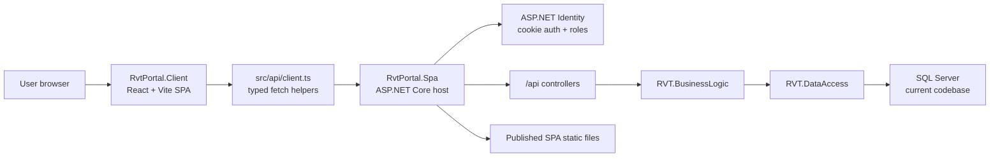

# RVT Portal React Port - Developer Onboarding
This guide is for developers joining the RVT Portal SPA work. Read it with the repository `README.md`, then use the release docs when you need detailed parity evidence.
## 1. Project Purpose
RVT Portal SPA is the React/Vite port of the RVT Monitoring portal. The goal is to preserve the existing RVT business workflows while replacing the legacy ASP.NET MVC page experience with a modern single-page application.
The port is not a complete backend rewrite. It keeps the existing RVT domain model, many service/repository concepts, ASP.NET Identity, and SQL Server data access while moving the user experience into React and exposing workflows through API controllers.
Future architecture documents may describe AKS, PostgreSQL, and TimescaleDB plans. This alpha repository still uses the current SQL Server-oriented application code.
## 2. What Changed From MVC
- Legacy MVC views and retired demo/debug projects are not part of this repository.
- React owns the browser shell, navigation, forms, panels, route rendering, and client-side API calls.
- `RvtPortal.Spa` owns authentication, authorization, API endpoints, Swagger, security middleware, static file serving, and the publish boundary.
- Shared libraries retain the migrated domain services, data access, entities, DTOs, email/blob helpers, and utilities.
- The release artifact is the ASP.NET Core host plus the built React client copied into `wwwroot`.
## 3. Architecture At A Glance

## 4. Repository Map
| Path | Purpose |
|---|---|
| `RvtPortal.Spa.sln` | Main solution for the SPA port. |
| `RvtPortal.Spa` | ASP.NET Core API host, Identity setup, middleware, Swagger, SPA publish integration. |
| `RvtPortal.Client` | React/Vite client application. |
| `RvtPortal.Spa.Tests` | Backend/API/host tests. |
| `RVT.BusinessLogic` | Domain services and application workflow logic. |
| `RVT.DataAccess` | EF contexts, repositories, persistence integration. |
| `RVT.Entities` | Shared entity, DTO, and model definitions. |
| `RVT.Utilities` | Email, blob, logging, and other utility services. |
| `docs/release` | Cutover, parity, and readiness evidence. |
## 5. Local Setup
Install:
- .NET SDK 10
- Node.js 24.x
Restore from the repository root:
```powershell
dotnet restore .\RvtPortal.Spa.sln
Set-Location .\RvtPortal.Client
npm ci
```
Configure local secrets outside Git. Do not commit real credentials. At minimum, the API needs `ConnectionStrings:DefaultConnection`; other production-only values include SMTP, blob storage, Redis, What3Words, Omnidots, and data-protection settings.
Run the API:
```powershell
dotnet run --project .\RvtPortal.Spa\RvtPortal.Spa.csproj --launch-profile https
```
Run the React client:
```powershell
Set-Location .\RvtPortal.Client
npm run dev
```
Typical local URLs:
- React client: `http://localhost:5173`
- API: `http://localhost:5178`
- HTTPS API: `https://localhost:5179`
- Swagger: `http://localhost:5178/swagger`
- Health check: `http://localhost:5178/api/health`
## 6. Authentication And Roles
The SPA keeps the existing ASP.NET Identity cookie model. It does not store bearer tokens in browser storage.
Main roles:
| Role | Purpose |
|---|---|
| `RVTMasterAdmin` | Full portal administration. |
| `RVTAdmin` | Standard RVT administration. |
| `RVTInstaller` | Installer monitor/deployment workflow access. |
| `CompanyUser` | Customer-scoped access to assigned company/site data. |
Server-side authorization is the source of truth. React navigation hides or shows routes for usability, but API controllers must still enforce role and data access rules.
Read `RvtPortal.Spa/AUTHORIZATION.md` before changing login, account, role, or protected endpoint behavior.
## 7. How To Trace A Workflow
For most features, use this path:
1. Start in `RvtPortal.Client/src/App.tsx` to find the route and role visibility.
2. Open the relevant panel in `RvtPortal.Client/src/admin` or `RvtPortal.Client/src/operations`.
3. Follow API calls through `RvtPortal.Client/src/api/client.ts`.
4. Open the matching controller in `RvtPortal.Spa/Api`.
5. Continue into `RVT.BusinessLogic`, then `RVT.DataAccess`, if the endpoint uses existing domain services.
6. Check tests in `RvtPortal.Spa.Tests` and `RvtPortal.Client/src/**/*.test.tsx`.
When changing a migrated MVC workflow, update the release evidence if the parity or readiness status changes.
## 8. Test And Build Gates
Run these before handing work over:
```powershell
dotnet restore .\RvtPortal.Spa.sln
dotnet build .\RvtPortal.Spa.sln --configuration Release --no-restore -v minimal
dotnet test .\RvtPortal.Spa.Tests\RvtPortal.Spa.Tests.csproj --configuration Release -v minimal
```
Client gates:
```powershell
Set-Location .\RvtPortal.Client
npm run lint
npm run build
npm run test:run
npm run test:e2e
```
Current known warning to expect during client build: Vite reports the main JavaScript bundle is larger than 500 kB. It is a release-polish item, not currently a failing gate.
## 9. Release Evidence
Use these files to understand cutover readiness:
- `docs/release/PARITY_MATRIX.md`: MVC-to-SPA migration ledger.
- `docs/release/FUNCTIONALITY_READINESS_MATRIX.md`: capability readiness and test evidence.
- `docs/release/CUTOVER_RUNBOOK.md`: deployment, smoke, rollback, and go/no-go checklist.
- `docs/onboarding/DATABASE_NAMING_ONBOARDING.md`: canonical database naming rules, DBR registries, and migrator expectations.
## 10. First Week Checklist
- Open `RvtPortal.Spa.sln` and confirm the solution builds.
- Run the API and React client locally.
- Read `README.md`, this guide, `RvtPortal.Spa/AUTHORIZATION.md`, and the readiness matrix.
- Read `docs/onboarding/DATABASE_NAMING_ONBOARDING.md` before touching migrations, raw SQL, reports, archive SQL, or the SQL Server-to-Postgres migrator.
- Trace one admin workflow and one company/installer workflow from React panel to API controller.
- Make a small first change that includes both frontend and backend tests where relevant.
- Keep local credentials in user secrets, environment variables, or ignored local overrides.
## 11. Common Pitfalls
- Do not reintroduce legacy MVC/demo projects unless there is an approved migration exception.
- Do not rely on React route hiding as authorization; enforce rules in the API.
- Do not commit connection strings or service credentials.
- `appsettings.json` intentionally contains placeholders.
- The Vite development client talks to the API through the configured dev origin/proxy behavior.
- When running Git through Parallels `prlctl`, add the safe-directory override because commands may execute as `NT AUTHORITY\SYSTEM`:
```powershell
git -c safe.directory='C:/Users/oldgeorge/source/repos/chris-oldgeorge/rvtportal-spa-alpha' status
```
## 12. Where To Ask Better Questions
Use the code layout to narrow questions:
- "How does this page render?" Start in `RvtPortal.Client/src/App.tsx`.
- "Where does this API come from?" Search `RvtPortal.Spa/Api`.
- "Why does this role see this route?" Read `AUTHORIZATION.md`, then `RoleAuthorization.cs` and `App.tsx`.
- "Is this migrated?" Check `docs/release/PARITY_MATRIX.md`.
- "Is this ready for release?" Check `docs/release/FUNCTIONALITY_READINESS_MATRIX.md` and `CUTOVER_RUNBOOK.md`.
