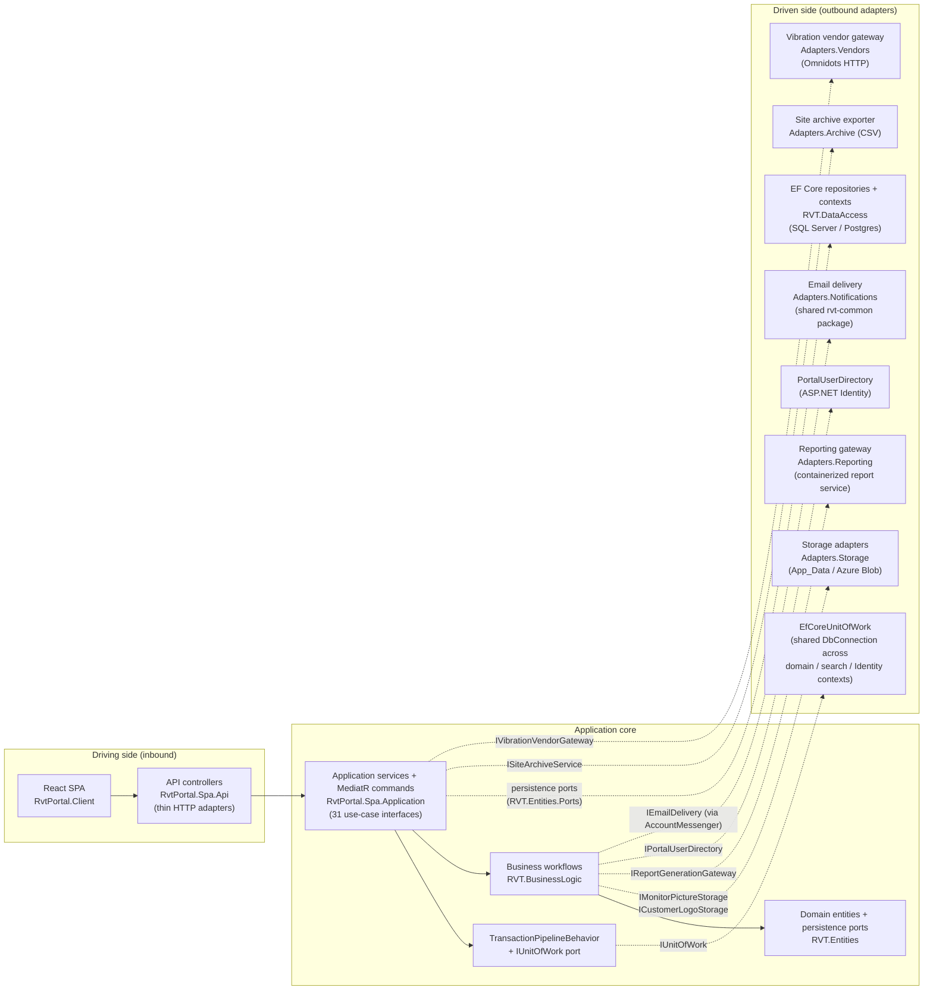
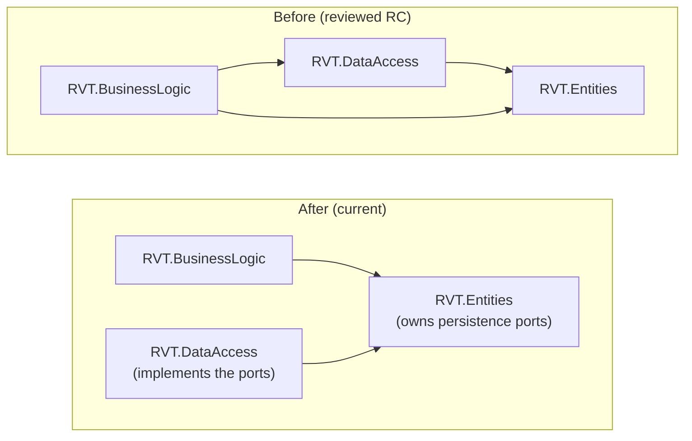
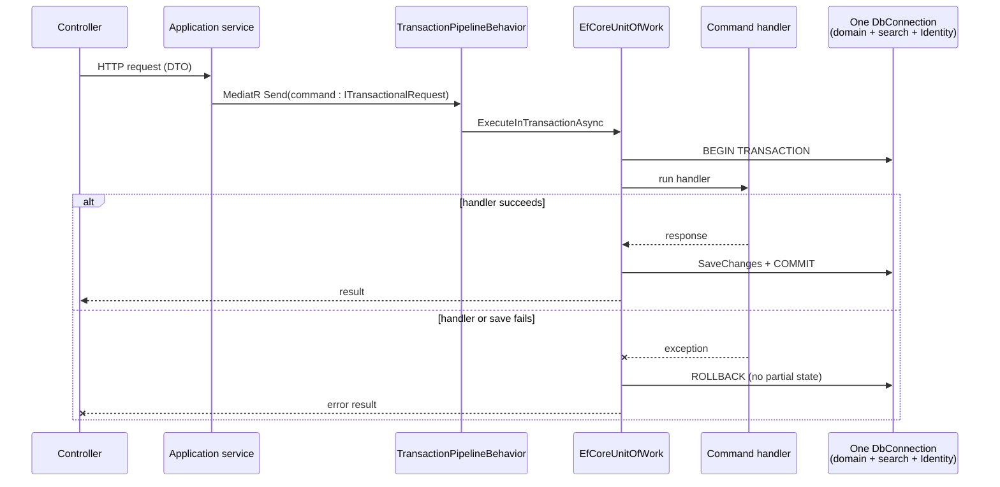

# RC Review Response — Point-by-Point Report

**Date:** 2026-07-15 (updated 2026-07-17)
**Scope:** all changes on `master` since the reviewed release candidate (the 2026-06-25 monitor code drop) up to commit `e81e856`.
**Volume:** 40 merged pull requests, ~100 commits, across six workstreams (architecture, data access, correctness, code quality, test quality, and completing the port extraction).

---

## Part 1 — Point-by-point responses to the review

### 1. "The agreed architecture going forward is Hexagonal / Ports and Adapters"

**Status: implemented and mechanically enforced.**

The July refactor wave (PRs #1–#6, then #10–#22) restructured the solution around explicit ports and adapters:

- **The dependency flip (PR #6).** The `RVT.BusinessLogic → RVT.DataAccess` project reference was **removed**. The business layer can no longer reach the persistence layer at compile time. Current project references:

  | Project | References |
  |---|---|
  | `RVT.Entities` (domain + persistence ports) | *(nothing)* |
  | `RVT.BusinessLogic` (business workflows + outbound ports) | Entities, Utilities |
  | `RVT.DataAccess` (persistence adapter) | Entities |
  | `RvtPortal.Spa` (host, application layer, inbound/outbound adapters, composition root) | all of the above |

  The only project that references everything is the host — which is exactly the composition root's job.

- **Persistence ports seated in the core (PR #1).** Eight repository/read-model interfaces now live in `RVT.Entities/Ports/Persistence`, owned by the domain; `RVT.DataAccess` implements them. Infrastructure depends on the core, not the reverse.

- **Application services relocated (PRs #2–#5).** `LookupService`, `CompanyService`, `MonitorService`, `SiteApplicationService`, `ReportRuleApplicationService`, and the site-archive subsystem were moved out of the legacy layers into `RvtPortal.Spa/Application` (18 feature folders, 31 service interfaces). The obsolete `SiteService` was retired.

- **Enforcement, not convention.** `CqrsArchitectureTests` contains 30+ dated guardrails that fail the build if the boundaries erode: controllers cannot take `IMediator` or a `DbContext` in their constructors, every controller must depend on an application-service interface, every mutating command must be transactional, no business-layer type may take `IHttpClientFactory` or reference the SendGrid SDK (vendor/email adapters live in the host — PRs #32/#33), `DateExtensions` must run no code at type load, and the lookup service must expose an async surface with no whole-table cache. The architecture is a test suite, not a diagram on a wiki. (The last two guards were originally brittle source-text scans; PR #34 re-expressed them as reflection over the compiled types — same intent, no string-matching.)

- **The shared-package boundary is enforced the same way (PRs #41/#42).** `RvtCommonDependencyBoundaryTests` governs the one third-party dependency the portal now takes on the shared `Rvt.Monitor.Common` packages: the package is **confined to the host adapter project**, the **compiled business core must not reference it at all**, and `NuGet.config` must take the private-feed credentials **from the environment rather than a committed token**. So adopting a shared package did not weaken the hexagonal boundary — it put the boundary under test.

### 2. "Any remaining areas where business logic is tightly mixed with infrastructure should be identified and corrected"

**Corrected since the RC:**

| Mixing found | Correction | PR |
|---|---|---|
| Business services living inside the data/business legacy layers, wired straight to EF | Relocated into the Spa application layer behind interfaces | #2–#5 |
| `RVT.BusinessLogic` compiled against `RVT.DataAccess` | Reference deleted; ports own the boundary | #6 |
| Write path that committed inside repositories (invisible transactions) | Retired; site creation made atomic through the unit of work | #13 |
| Search read path built on sync-over-async with unbounded results | Rewritten async, no-tracking, explicitly bounded | #12 |
| Static appsettings reads at type load (`DateExtensions`) | Removed; guarded by an architecture test | #27 wave |
| ASP.NET `IFormFile` leaking into command handlers | Wrapped behind `IUploadedContent` / `FormFileUpload` | storage-ports work |
| `OmnidotsVibrationApiService` did vendor HTTP directly (`IHttpClientFactory` + `IConfiguration`) in the business layer | Moved behind `IVibrationVendorGateway`; adapter in `RvtPortal.Spa/Adapters/Vendors`; the mutable `ErrorCode` became a result record and a `CancellationToken` was added. Guarded so no business type takes `IHttpClientFactory` | #32 |
| `MessageService` / `EmailSender` mixed templating with SendGrid delivery in the business/utility layers | Split: templates → pure core `AccountMessageCatalog`, delivery → `IEmailDelivery` adapter; SendGrid SDK removed from the core/utility layers (guarded); dead SMTP path retired | #33 |

**Both areas flagged as still-mixed in the first draft of this response are now corrected** (PRs #32, #33 — the last two rows above). One deliberate exception remains:

1. **`UploadMonitorPictureCommand`** manages its own persistence rather than using the transaction pipeline. This is a **documented design choice** (recorded in commit `05a6d5f`): file storage is not transactional, so the handler compensates explicitly — it deletes the stored file if database persistence fails. It is the single allowed exception in the architecture test.

With those two ports in place, `RVT.BusinessLogic` now holds **no `IHttpClientFactory`, no vendor SDK, and no direct infrastructure construction** — every outbound side effect (persistence, storage, reporting, identity, vendor HTTP, email) crosses a core-owned port, each enforced by an architecture test.

*Note on the email adapter (updated 2026-07-17):* email delivery is now served by the shared **`Rvt.Monitor.Common.Infrastructure` (rvt-common) 0.2.0-rc.1** package (PR #42). It was first built locally behind the core-owned `IEmailDelivery` port with the rvt-common swap documented as a seam — and the seam proved out exactly as designed: adopting the shared adapter touched **only the adapter and DI registration**. `IEmailDelivery`, `AccountMessageCatalog`, `AccountMessenger`, and the auth/user-account workflows were unchanged, because the port is owned by the core rather than by the package.

*What adopting the shared package costs, stated plainly:* it is restored from the **private `RVT-Group-LTD` GitHub Packages feed**, so the build now needs feed access. Credentials are read from the environment (`RVT_PACKAGES_USER` / `RVT_PACKAGES_TOKEN`) and **no token is committed** — a guardrail fails the build if one ever is — but CI does now require a `read:packages` secret, where previously it needed none. The package also pulls heavy transitive dependencies (AWS S3, MQTT, Quartz, OpenTelemetry, SQL Server/Npgsql drivers) into the **host**. That weight stops at the adapter boundary: `RVT.BusinessLogic` gains nothing from it and cannot reference the package, which is exactly what the boundary tests assert. The portal's own `EmailConfiguration` keys were mapped onto the package's `CommunicationsOptions` at startup, so **deployed configuration is unchanged**.

The remaining rvt-common opportunity is storage: re-pointing `SiteArchiveService` at rvt-common's `IBlobStorageService` (existing TODO), which is the same one-adapter swap.

### 3. "Some poor coding practices in a few areas"

Addressed in three sweeps:

- **Globalization cluster (PR #27):** every culture-sensitive comparison, casing, and formatting call (`CA1304`, `CA1311`, `CA1862`, `CA1305`) resolved with explicit culture/ordinal semantics.
- **Code-review findings (PR #28):** a fire-and-forget async bug (exceptions silently lost), culture bugs in string handling, and a full compiler-warning triage.
- **Consistency:** folder-casing fix and `ISearchQueryReader` rename (PR #7), magic values in tests replaced with shared named fixtures (PR #8), placeholder hygiene in connection-string examples.

The June security sweep (pre-dating the July wave, after the RC) also hardened cookies, uploads, CSRF, rate limiting, security headers, and data protection, and patched npm dependencies.

### 4. "Potential errors"

The refactor deliberately hunted for latent errors rather than only moving code. Confirmed and fixed since the RC:

| Latent error | Fix | PR |
|---|---|---|
| Unknown filter/sort fields **silently matched everything** (a bad query returned the whole table instead of failing) | Rejected with an explicit error | #17 |
| Column-name mangling: `fleet_nr` had become `fleet_row_count` via an unanchored rename heuristic | Corrected (breaking migration), heuristics replaced with an explicit name map | #19, #20 |
| Postgres post-load script **destroyed a view** on every run | Fixed; EF migrations made actually usable | #23 |
| Two `NOT NULL` columns lost their defaults during schema codification | Defaults restored | #26 |
| Reads silently truncated at provider limits | Truncation surfaced; schema validated at boot; keyless table names pinned | #22 |
| Dashboard/recipient/site N+1 query storms; ownership filtering done in memory | Filtered and paged in SQL | #15, #16 |
| Fire-and-forget async call losing exceptions | Awaited properly | #28 |
| Transaction failure paths could leave partial state | Three integrity fixes | #29 |

### 5. "Missed opportunities for code reuse"

- **Consolidated the time-series repositories** and deleted dead legacy read services, orphaned repositories, and unused mapper projections (PR #1) — the largest single de-duplication.
- **Collapsed the repeated latest-deployment subquery** that had been copy-pasted across site queries (PR #16).
- **Shared named test fixtures** replaced per-file magic values (PR #8).
- **`TestData` entity factory** (PR #31): a single database-derived object-mother replaced six divergent hand-rolled entity builders across the test suite (−150 net lines, and it immediately caught a real drift bug between files).
- Test-suite pruning (PR #30) removed 16 duplicated/tautological tests so the remaining tests all pull their weight.

### 6. "Earlier recommendations not fully incorporated into the new code release"

The structural answer: recommendations are now **converted into executable guardrails** instead of relying on developer memory. `RvtPortal.Spa.Tests/CqrsArchitectureTests.cs` carries a dated changelog of every recommendation adopted (30+ entries, 2026-06-09 → 2026-07-09), each one backed by a reflection or pipeline test that fails the build on regression. A recommendation that is a failing test cannot be "not incorporated" silently.

Supporting paper trail: `docs/architecture/hexagonal-edges-change-log.md`, `docs/architecture/ports-and-adapters-catalog.md`, the Sonar remediation plans under `docs/superpowers/plans/`, and `docs/database/transaction-failure-paths-remediation.md`.

### 7. "There is no .editorconfig file to enforce consistent code quality rules"

**Resolved.** A 25.6 KB `.editorconfig` (derived from the dotnet/roslyn ruleset, `root = true`) is active at the repository root:

- It existed pre-review but was named `editorconfig` — invisible to all tooling. Renamed so it actually applies (PR #9, commit `97c69bc`).
- Activating it exposed real violations that had been accumulating; those were fixed rather than suppressed (PR #21, PR #27).
- Analyzer severities in the file are enforced at **build time**, in CI, for every PR. The test project is deliberately excluded from the CA analyzer ruleset (PR #27) — test code has different idioms, and the exclusion is explicit rather than accidental.

### 8. "dotnet format should be run to tidy the code before the next review"

**Done:** `dotnet format --verify-no-changes` was run and exits **clean (0)** on `master` at `db6202d`. Every merge since then passes the Release build with analyzers-as-errors and follows the same conventions, and CI's mandatory `verify` job (build + full test suite + `git diff --check`) is green on the current tip (`e81e856`); a formal `dotnet format` re-run on that tip is the one remaining confirmation.

*Recommendation:* add `dotnet format --verify-no-changes` as a CI step so formatting stays enforced mechanically rather than by request — this also removes the need for manual re-runs.

### 9. "Database transaction management is still missing (or unviewable)"

**"Unviewable" was the accurate word — it existed but was invisible from the handlers.** Transaction management is centralized in the MediatR pipeline rather than scattered through handler code, so reading any individual handler shows no transaction calls by design. Since the RC it has also been substantially hardened. The full picture:

- **Where it lives:**
  - `RvtPortal.Spa/Application/Common/TransactionPipelineBehavior.cs` — a MediatR `IPipelineBehavior` that wraps every command implementing `ITransactionalRequest` in a transaction.
  - `RvtPortal.Spa/Application/Common/EfCoreUnitOfWork.cs` — the `IUnitOfWork` implementation coordinating the three DbContexts (domain, search, Identity), which **share one scoped `DbConnection`** so a single database transaction covers all of them.
- **How it's enforced:** the architecture test `MutatingApplicationCommands_AreTransactional` fails the build if any command does not opt into the transaction pipeline (single documented exception: the picture upload, see §2.3). Behavior tests cover commit-once, rollback-on-handler-failure, rollback-on-save-failure, and no-partial-commit scenarios.
- **Hardening since the RC:**
  - Connection resiliency and unit-of-work hardening (PR #10).
  - The self-committing write path — repositories quietly saving mid-command — was retired, and site creation made atomic (PR #13).
  - Transaction **failure-path integrity** — three fixes ensuring a failed command cannot leave partial state (PR #29, with a written remediation plan in `docs/database/transaction-failure-paths-remediation.md`).

Transaction management is therefore not missing; it is a deliberate cross-cutting concern with build-failing enforcement, and the failure paths flagged as "fundamental before release" were fixed in PR #29.

---

## Part 2 — Architecture diagrams (current state)

### 2.1 Hexagonal overview

Dashed lines are **port crossings** — an interface owned by the core, implemented by the adapter. Solid lines are plain in-process calls in the allowed direction.

### 2.2 The dependency flip (PR #6)

Before, business logic compiled against the persistence layer and could touch it freely. Now both depend inward on the domain; only the host wires them together.

### 2.3 Transaction pipeline (write path)

Queries (no `ITransactionalRequest`) bypass the unit of work entirely — verified by test.

---

## Part 3 — Ports and adapters catalog (current)

### Outbound ports and their adapters

| Port (owned by the core) | Defined in | Adapter | Adapter location |
|---|---|---|---|
| `ICompanyRepository` | `RVT.Entities/Ports/Persistence` | `CompanyRepository` | `RVT.DataAccess` |
| `IMonitorRepository` | `RVT.Entities/Ports/Persistence` | `MonitorRepository` | `RVT.DataAccess` |
| `IDeploymentRepository` | `RVT.Entities/Ports/Persistence` | `DeploymentRepository` | `RVT.DataAccess` |
| `IAlertlevelRepository` | `RVT.Entities/Ports/Persistence` | `AlertlevelRepository` | `RVT.DataAccess` |
| `ISearchQueryReader` | `RVT.Entities/Ports/Persistence` | `SearchQueryReader` | `RVT.DataAccess` |
| `IOmnidotsSensorRepository` | `RVT.Entities/Ports/Persistence` | `OmnidotsSensorRepository` | `RVT.DataAccess` |
| `IOmnidotsBreachesAndAlertsRepository` | `RVT.Entities/Ports/Persistence` | `OmnidotsBreachesAndAlertsRepository` | `RVT.DataAccess` |
| `ISvantekMonitorStatusRepository` | `RVT.Entities/Ports/Persistence` | `SvantekMonitorStatusRepository` | `RVT.DataAccess` |
| `IUnitOfWork` / `ITransactionalRequest` | `RvtPortal.Spa/Application/Common` | `EfCoreUnitOfWork` | `RvtPortal.Spa/Application/Common` |
| `ICustomerLogoStorage` | `RVT.BusinessLogic/Ports/Storage` | `CustomerLogoStorage` | `RvtPortal.Spa/Adapters/Storage` |
| `IMonitorPictureStorage` | `RVT.BusinessLogic/Ports/Storage` | `MonitorPictureStorage` | `RvtPortal.Spa/Adapters/Storage` |
| `IUploadedContent` | `RVT.BusinessLogic/Ports/Storage` | `FormFileUpload` (wraps `IFormFile`) | `RvtPortal.Spa/Adapters/Storage` |
| `IReportGenerationGateway` | `RVT.BusinessLogic/Reports` | `ReportGenerationGateway` (+ internal HTTP `ReportGenerationClient`) | `RvtPortal.Spa/Adapters/Reporting` |
| `IVibrationVendorGateway` | `RVT.BusinessLogic/Ports/Vendors` | `OmnidotsVibrationGateway` (typed options + named `HttpClient`) | `RvtPortal.Spa/Adapters/Vendors` |
| `IEmailDelivery` | `RVT.BusinessLogic/Ports/Notifications` | `RvtCommonEmailDelivery` → shared **rvt-common** `IEmailDeliveryPort` / `SendGridEmailAdapter` | `RvtPortal.Spa/Adapters/Notifications` |
| `IAccountMessenger` (composes the catalog + `IEmailDelivery`) | `RVT.BusinessLogic/Notifications` | `AccountMessenger` | `RVT.BusinessLogic/Notifications` |
| `IPortalUserDirectory` | `RVT.BusinessLogic/Application` | `PortalUserDirectory` (ASP.NET Identity) | `RvtPortal.Spa.Api` |
| `IRvtDateTimeProvider` | `RVT.BusinessLogic` | `RvtDateTimeProvider` | `RVT.BusinessLogic` (singleton; swappable in tests) |
| `ISiteArchiveService` (+ `ISiteArchiveQueryCatalog`, `ISiteArchiveQueryExecutor`, `ISiteArchiveCsvWriter`, `ISiteArchiveWorkspaceFactory`) | `RvtPortal.Spa/Adapters/Archive` | same-named implementations | `RvtPortal.Spa/Adapters/Archive` |

### Inbound (driving) boundary

- 20+ thin HTTP controllers in `RvtPortal.Spa.Api`, each depending on an application-service interface or MediatR commands — never on `IMediator` directly, never on a `DbContext` (both enforced by tests).
- 31 application-service interfaces across 18 feature areas (`Application/{AlertLevels, Auth, Companies, Contracts, Dashboard, Data, Help, Installers, Lookups, Monitors, Notifications, ReportContent, ReportRules, Reports, Sites, Users, Common, …}`).
- All port→adapter wiring happens in one composition root: `RvtPortal.Spa/ServiceCollectionExtensions.cs` (~55 registrations, including the vendor gateway, email delivery, and account messenger added by PRs #32/#33).

*(This supersedes the earlier `docs/architecture/ports-and-adapters-catalog.md` where the two disagree — that file predates the PR #1/#6 dependency flip.)*

---

## Part 4 — Other meaningful changes since the RC

- **Database built from code alone (PRs #23, #24, #26):** EF migrations are now the single source of schema truth; the legacy compatibility layer and `RVT.DatabaseMigrator` were retired; boot-time schema validation catches drift immediately.
- **Query performance (PRs #15, #16):** site lists paged in SQL, ownership windows filtered in SQL, dashboard/recipient/site N+1s eliminated, duplicate subqueries collapsed.
- **Completed the port extraction (PRs #32–#34):** the two remaining business-logic/infrastructure mixings were ported behind core-owned ports (`IVibrationVendorGateway`, `IEmailDelivery`), and the last two brittle source-text architecture guards were renovated to reflection. `RVT.BusinessLogic` is now free of `IHttpClientFactory` and the SendGrid SDK, both enforced by tests.
- **Adopted the shared rvt-common email adapter (PR #42):** account email is delivered through `Rvt.Monitor.Common.Infrastructure` 0.2.0-rc.1 from the private RVT-Group-LTD feed (credentials read from the environment; none committed). The dependency is confined to the host adapter layer — the compiled business core must not reference it, enforced by `RvtCommonDependencyBoundaryTests`. Portal `EmailConfiguration` keys were mapped onto the shared `CommunicationsOptions`, so deployed configuration is unchanged.
- **Test suite quality (PRs #8, #30, #31):** shared fixtures, 16 insignificant tests removed after a full significance audit, and a database-derived entity factory (`TestData`) so test entities mirror real production data shapes. Suite currently: **313 passed / 3 skipped / 0 failed**.
- **Security hardening (June 25 wave):** auth rate limiting, security headers, CSRF hardening, cookie/upload/data-protection hardening, npm dependency patches, dev credentials removed from tracking.
- **CI quality gate:** every PR runs build + full test suite + .NET and client coverage + SonarCloud analysis; the analysis is green on current `master`.

## Recommended next steps

1. Re-point `SiteArchiveService` at rvt-common's `IBlobStorageService` (existing TODO) — the same one-adapter swap the email port just proved out, now that the shared package is wired in. *(The email half of this recommendation was completed in PR #42.)*
2. Add `dotnet format --verify-no-changes` to CI.
3. Add `sonar.qualitygate.wait=true` to the SonarCloud step so the CI status reflects the quality gate verdict, not just analysis upload.
4. Incrementally migrate the remaining entity types (Company/Site/Contract/Deployment/Notification) to the `TestData` factory, per file, verifying field-by-field.
