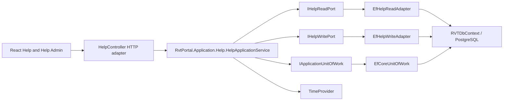

# Help Admin Application Boundary Design

**Date:** 2026-07-28  
**Status:** Approved design awaiting implementation  
**Decision owner:** RVT Portal product owner  
**Target branch:** `codex/help-admin-application-boundary`

## Purpose

Help Admin will ship as a supported Portal capability. The feature will no
longer be described or treated as excluded or development-only.

The implementation will extract the complete Help vertical slice into the
standalone `RvtPortal.Application` project. Published Help and administrative
Help workflows will share one application boundary, while ASP.NET Core, Entity
Framework Core, PostgreSQL entities, and HTTP DTOs remain host-side adapters.

## Current problem

The current React route and API already provide Help administration, but the
server-side workflow lives under `RvtPortal.Spa.Application.Help` and directly
depends on:

- ASP.NET API request contracts;
- `RVTDbContext` and Entity Framework Core;
- PostgreSQL-backed entities;
- MediatR and host-owned transactional commands; and
- `DateTime.UtcNow`.

The controller is thin, but the use case is not independent of its adapters.
The release matrix also marks the capability `EXCLUDED`, even though it is
compiled into the production client.

## Scope

The shipped capability includes:

- authenticated published Help browsing for RVT administrators and company
  users;
- administrator listing and filtering of draft and published articles;
- administrator article creation, editing, publication, unpublication, preview,
  and deletion;
- section assignment by section slug;
- linked asset metadata for documents, videos, and links;
- immutable asset identity across edits;
- role checks at both HTTP and application boundaries;
- safe URL validation;
- transactional persistence and injected UTC time;
- predictable keyboard focus after mutations;
- architecture, unit, adapter, API, client, browser, and release regression
  coverage; and
- updated release and architecture documentation.

## Non-goals

This change will not add:

- binary asset upload, download, deletion, or object storage;
- a section-management screen independent of article editing;
- anonymous Help access;
- rich-text or Markdown rendering;
- content revision history or author audit columns;
- a compatibility alias for the previously unapproved
  `POST /api/help/articles` mutation route; or
- database schema changes.

Linked assets remain URL metadata. Existing published Help and report-rule
guideline reads remain supported.

## Selected architecture

The complete Help slice will follow the ports-and-adapters pattern established
by the Sites slice.



Dependency direction is inward:

- `RvtPortal.Application` owns use cases, contracts, validation, authorization
  policy, result semantics, and port interfaces.
- `RvtPortal.Spa` owns HTTP mapping, current-user adaptation, dependency
  injection, EF adapters, and persistence entities.
- `RvtPortal.Client` consumes only the HTTP contract.

`RvtPortal.Application` remains BCL-only and must not reference ASP.NET Core,
Entity Framework Core, MediatR, `RVT.Entities`, `RVT.DataAccess`, or
`RvtPortal.Spa`.

## Application project structure

The application slice will use these focused files:

```text
apps/portal/RvtPortal.Application/Help/
├── HelpApplicationService.cs
├── HelpAuthorizationPolicy.cs
├── HelpContracts.cs
├── HelpMutationValidator.cs
├── IHelpApplicationService.cs
└── Ports/
    ├── IHelpReadPort.cs
    └── IHelpWritePort.cs
```

### Application service

`IHelpApplicationService` will expose:

```csharp
Task<UseCaseResult<HelpOverviewModel>> QueryPublishedAsync(
    PortalUserContext actor,
    string? searchText,
    CancellationToken cancellationToken);

Task<UseCaseResult<HelpArticleModel>> GetPublishedArticleAsync(
    PortalUserContext actor,
    string slug,
    CancellationToken cancellationToken);

Task<UseCaseResult<HelpAdminOverviewModel>> QueryAdminAsync(
    PortalUserContext actor,
    HelpAdminQuery query,
    CancellationToken cancellationToken);

Task<UseCaseResult<HelpArticleModel>> GetAdminArticleAsync(
    PortalUserContext actor,
    Guid articleId,
    CancellationToken cancellationToken);

Task<UseCaseResult<HelpArticleModel>> CreateAsync(
    PortalUserContext actor,
    HelpArticleMutation mutation,
    CancellationToken cancellationToken);

Task<UseCaseResult<HelpArticleModel>> UpdateAsync(
    PortalUserContext actor,
    Guid articleId,
    HelpArticleMutation mutation,
    CancellationToken cancellationToken);

Task<UseCaseResult<HelpArticleModel>> SetPublicationAsync(
    PortalUserContext actor,
    Guid articleId,
    bool isPublished,
    CancellationToken cancellationToken);

Task<UseCaseResult<HelpDeleteResult>> DeleteAsync(
    PortalUserContext actor,
    Guid articleId,
    CancellationToken cancellationToken);
```

Every mutation will execute through
`IApplicationUnitOfWork.ExecuteInTransactionAsync`. Adapters stage entity
changes; the application service calls `SaveChangesAsync` once at the intended
transaction point. Post-mutation response models are re-read through
`IHelpReadPort` before the transaction completes.

`TimeProvider.GetUtcNow().UtcDateTime` supplies `CreatedAtUtc` and
`UpdatedAtUtc`. Application and adapter code will not call `DateTime.Now`,
`DateTime.Today`, or `DateTime.UtcNow`.

### Authorization policy

`HelpAuthorizationPolicy` will define:

- `CanReadPublished(actor)`: `actor.IsAdmin || actor.IsCompanyUser`;
- `CanManage(actor)`: `actor.IsAdmin`.

Published operations return `Forbidden` when `CanReadPublished` is false.
Administrative operations return `Forbidden` when `CanManage` is false.

The existing controller attributes remain in place as the first enforcement
boundary:

- published endpoints allow the two RVT administrator roles and Company User;
- administrative endpoints allow only the two RVT administrator roles.

Application checks are mandatory defense in depth and protect non-HTTP callers
and future adapters.

### Application contracts

Application contracts are transport-neutral records and models. They include:

- `HelpAdminQuery`;
- `HelpArticleMutation`;
- `HelpAssetMutation`;
- `HelpOverviewModel`;
- `HelpAdminOverviewModel`;
- `HelpSectionModel`;
- `HelpArticleSummaryModel`;
- `HelpArticleModel`;
- `HelpAssetModel`;
- `HelpMutationValidationData`; and
- `HelpDeleteResult`.

`HelpAssetMutation.Id` is nullable:

- an existing persisted asset supplies its immutable ID;
- a new asset supplies `null`;
- an update containing an ID that does not belong to the target article fails
  validation.

The application boundary never accepts or exposes API DTO types.

## Ports

### Read port

`IHelpReadPort` will provide persistence-neutral reads:

- published section/article search;
- published article lookup by slug;
- filtered administrative overview;
- administrative article lookup by ID; and
- mutation validation data, including slug ownership and the target article's
  existing asset IDs.

Filtering, ordering, and projection belong in the EF read adapter so the
application service does not load all articles and filter them in memory.

Published ordering remains:

1. section sort order;
2. section title;
3. article sort order;
4. article title.

Administrative ordering remains:

1. section sort order;
2. section title;
3. article sort order;
4. article title.

### Write port

`IHelpWritePort` will stage:

- article creation;
- article update;
- publication state changes; and
- article deletion.

The write adapter receives validated, canonical application mutations and UTC
timestamps. It must not call `SaveChanges`.

Article updates reconcile linked assets by immutable ID:

- update matching assets in place;
- add new assets with server-generated IDs;
- remove assets omitted from the mutation; and
- reject foreign or unknown existing IDs before staging the update.

This replaces the current delete-and-recreate behavior and keeps asset identity
stable.

## Validation and canonicalization

`HelpMutationValidator` is pure application code. It returns
`UseCaseError` values with stable field names suitable for API validation
responses.

### Required values and limits

The validator enforces:

| Field | Rule |
| --- | --- |
| Section title | required, maximum 120 characters |
| Section slug | required, maximum 120 characters, lowercase kebab case |
| Article title | required, maximum 160 characters |
| Article slug | required, maximum 160 characters, lowercase kebab case |
| Summary | optional, maximum 512 characters |
| Body | required, maximum 100,000 characters |
| Content type | one of `FAQ`, `Article`, `Document`, `Video`, `Definition` |
| Section/article order | zero or greater |
| Asset title | required, maximum 160 characters |
| Asset type | one of `Document`, `Video`, `Link` |
| Asset URL | required, maximum 512 characters, safe URL policy |
| Asset order | zero or greater |

Slugs use:

```text
^[a-z0-9]+(?:-[a-z0-9]+)*$
```

Content and asset types are accepted case-insensitively and stored using the
canonical values shown above.

Article slugs are globally unique. The validator uses
`HelpMutationValidationData` to distinguish the current article from a
conflicting article.

### URL policy

Persisted asset URLs may be:

- an absolute HTTPS URL; or
- a root-relative path beginning with `/help-assets/`.

The validator rejects:

- `http`, `javascript`, `data`, `file`, and other schemes;
- protocol-relative URLs beginning `//`;
- backslashes;
- control characters;
- user-info credentials; and
- fragments or encodings that produce an invalid URI.

`InternalPath` is no longer accepted from the browser. The write adapter derives
it from a valid `/help-assets/` URL and otherwise stores `null`.

Before release, existing `help_asset` rows must be checked against this policy.
The release is blocked until incompatible rows are corrected deliberately.

## EF adapters

Host-side adapters will live under:

```text
apps/portal/RvtPortal.Spa/Adapters/Help/
├── EfHelpReadAdapter.cs
└── EfHelpWriteAdapter.cs
```

The read adapter uses `AsNoTracking`, server-side predicates, deterministic
ordering, and direct projection to application models. Queries must remain
provider-translatable and bounded by their intended result set.

The write adapter uses tracked `HelpSection`, `HelpArticle`, and `HelpAsset`
entities. It may create a section when no section with the canonical slug
exists and may update that section's title and sort order as part of an article
mutation. Sections remain published because this release has no independent
section publication workflow.

Moving or deleting the last article does not delete the empty section. Empty
sections are absent from published results and remain visible in administrative
section metadata.

No schema migration is required. Existing canonical PostgreSQL table and index
names remain unchanged.

## HTTP API

`HelpController` remains a controller-based API and delegates every operation
to `IHelpApplicationService`. It also receives
`ICurrentUserContextFactory` and `IApiResultMapper`.

The shipped routes are:

| Method | Route | Access |
| --- | --- | --- |
| GET | `/api/help` | RVT administrators and Company User |
| GET | `/api/help/articles/{slug}` | RVT administrators and Company User |
| GET | `/api/help/admin` | RVT administrators |
| GET | `/api/help/admin/articles/{id}` | RVT administrators |
| POST | `/api/help/admin/articles` | RVT administrators |
| PUT | `/api/help/admin/articles/{id}` | RVT administrators |
| POST | `/api/help/admin/articles/{id}/publication` | RVT administrators |
| DELETE | `/api/help/admin/articles/{id}` | RVT administrators |

The old `POST /api/help/articles` mutation route is removed. Help Admin was not
an approved external release, so it has no mutation-route compatibility
promise.

API request/response DTOs remain in `RvtPortal.Spa.Api`. `HelpApiMapper` maps
both directions between API DTOs and application contracts. API validation
failures use `ValidationProblemDetails`; missing articles return `404`;
application authorization failures return `403`; duplicate slugs and unknown
asset IDs return field-level validation responses. The database unique index
remains the final integrity guard for a concurrent duplicate-slug race;
unexpected persistence races flow through centralized secret-safe Problem
Details rather than exposing provider details.

Creation returns `201 Created` with a location for the canonical administrative
article route.

## Dependency injection

The composition root registers:

```csharp
services.AddScoped<IHelpApplicationService, HelpApplicationService>();
services.AddScoped<IHelpReadPort, EfHelpReadAdapter>();
services.AddScoped<IHelpWritePort, EfHelpWriteAdapter>();
```

The existing `IApplicationUnitOfWork`, `ICurrentUserContextFactory`,
`IApiResultMapper`, `RVTDbContext`, and `TimeProvider` registrations are reused.

The old host-side `RvtPortal.Spa.Application.Help` service and MediatR command
handlers are removed after the new slice passes its tests.

## React client

`/admin/help` becomes an explicitly approved production route. The navigation,
route resolution, direct-route authorization, page title, and panel remain
available to both RVT administrator roles.

The client changes the create request to:

```text
POST /api/help/admin/articles
```

### Stable asset rows

Form state will wrap each API asset mutation in a client-only row model:

```typescript
type HelpAssetFormRow = HelpAssetMutationRequest & {
  clientKey: string;
};
```

- persisted assets use `asset.id` as `clientKey`;
- new rows use `crypto.randomUUID()`;
- editing title, type, URL, or order never changes `clientKey`;
- `clientKey` is removed before sending the API request.

The API mutation includes the persisted `id` when one exists so the server can
reconcile assets without replacing their identities.

### Focus behavior

Every article card exposes its immutable article ID through a ref registry or
stable data attribute.

- after create or update, focus moves to the saved article's Edit button;
- after publication changes, focus returns to that article's publication
  button;
- after delete, focus moves to the next article, then the previous article, and
  finally the New Content control when the list is empty;
- adding an asset focuses its title input;
- removing an asset focuses the next asset title, previous asset title, or Add
  Asset button.

Focus lookup never depends on editable article or asset titles.

## Error handling

Expected use-case outcomes use `UseCaseResult<T>`:

- `Success`;
- `NotFound`;
- `Forbidden`;
- `Validation`.

The application service does not catch unexpected persistence exceptions.
Central ASP.NET Core exception handling remains responsible for unexpected
failures, including a database-only duplicate-slug race, and returns
secret-safe Problem Details. The normal pre-write duplicate check produces the
field-level validation response used by ordinary requests.

Cancellation tokens flow from the HTTP request through the application service,
ports, EF queries, and unit of work without replacement.

## Testing strategy

### Application tests

Pure tests instantiate `HelpApplicationService` with fake read/write ports, a
fake unit of work, and a fixed `TimeProvider`. They cover:

- published and administrative authorization;
- every mutation's transaction and single-save behavior;
- UTC timestamps from the injected clock;
- validation and canonicalization;
- duplicate slug detection;
- existing, new, foreign, and removed asset IDs;
- not-found results; and
- cancellation propagation.

### Architecture tests

Guards prove:

- `RvtPortal.Application` remains BCL-only;
- Help application sources do not reference host, API, EF, entity, or MediatR
  types;
- `HelpController` depends on the standalone application interface;
- Help adapters live under `RvtPortal.Spa.Adapters.Help`;
- adapters do not call `SaveChanges`; and
- the old `RvtPortal.Spa.Application.Help` namespace no longer exists.

Every new guard is mutation-tested: it must fail against the prohibited
dependency or call and pass after restoration.

### Adapter and API tests

EF adapter tests cover filtering, deterministic ordering, projection, section
creation/reuse, asset reconciliation, publication, deletion, and generated SQL
translation where the provider supports it.

API integration tests cover:

- Company User published reads;
- Company User and Installer denial from every administrative endpoint;
- both RVT administrator roles;
- create, read, update, publish, unpublish, preview, and delete;
- canonical create route and removal of the old mutation route;
- unsafe URL rejection;
- duplicate slug and foreign asset-ID rejection; and
- Problem Details response shapes.

No schema or `DateTime.Kind` behavior is inferred solely from EF InMemory.
Existing timestamptz guards remain authoritative, and a real PostgreSQL test is
added only if adapter behavior cannot be proven by the existing PostgreSQL
coverage and schema guards.

### Client and browser tests

Vitest/Testing Library tests cover:

- route and navigation visibility for both administrator roles;
- direct-route denial for other roles;
- canonical API routes;
- CRUD and publication flows;
- stable asset keys while editing titles;
- focus restoration for article and asset mutations;
- validation rendering; and
- published Help and report-guideline behavior remaining intact.

Playwright covers an administrator journey from navigation through article
creation, publication, preview, editing, and deletion, plus a Company User
denial check.

### Verification commands

The implementation plan will use focused RED/GREEN commands first, followed by:

```bash
dotnet test apps/portal/RvtPortal.Spa.Tests/RvtPortal.Spa.Tests.csproj
npm test -- --run
npm run lint
npm run build
npm run test:e2e
dotnet build apps/portal/RvtPortal.Spa.sln -c Release
```

Repository architecture, engineering-standard, release-export, and
PostgreSQL-specific guards applicable to the touched scope must also pass.

## Release and documentation changes

The implementation updates:

- `docs/release/portal/FUNCTIONALITY_READINESS_MATRIX.md`;
- `docs/reviews/2026-07-27-project-architecture-and-code-quality-review.md`;
- the Portal architecture documentation and component catalog;
- relevant API/release runbooks;
- `docs/development/portal/development-guidelines.md` if a new Help invariant
  receives a guard; and
- `project_state.md`.

Help Admin changes from `EXCLUDED` to `READY` only after:

1. application, adapter, API, client, and browser suites pass;
2. both administrator roles and denied roles are verified;
3. existing persisted asset URLs pass the safe-URL readiness check;
4. the production client build contains the approved route;
5. the sanitized client export retains required source and release evidence;
6. the published Help and report-guideline regressions pass; and
7. rollback instructions are documented.

Rollback removes the Help Admin navigation/route and disables administrative
mutation endpoints while retaining published Help reads and database content.
No destructive data rollback is required.

## Implementation sequence

The detailed implementation plan will preserve a working system after each
reviewable step:

1. add application contracts, policies, validation, and focused RED tests;
2. add application ports and service transaction behavior;
3. add EF read/write adapters and adapter tests;
4. rewire dependency injection, controller mapping, routes, and API tests;
5. remove the old host-side Help application implementation;
6. repair client asset identity, focus, canonical routes, and tests;
7. add browser and release-readiness gates;
8. update architecture/release documentation; and
9. run complete verification and an independent review.

No broad Portal rewrite is part of this change.
