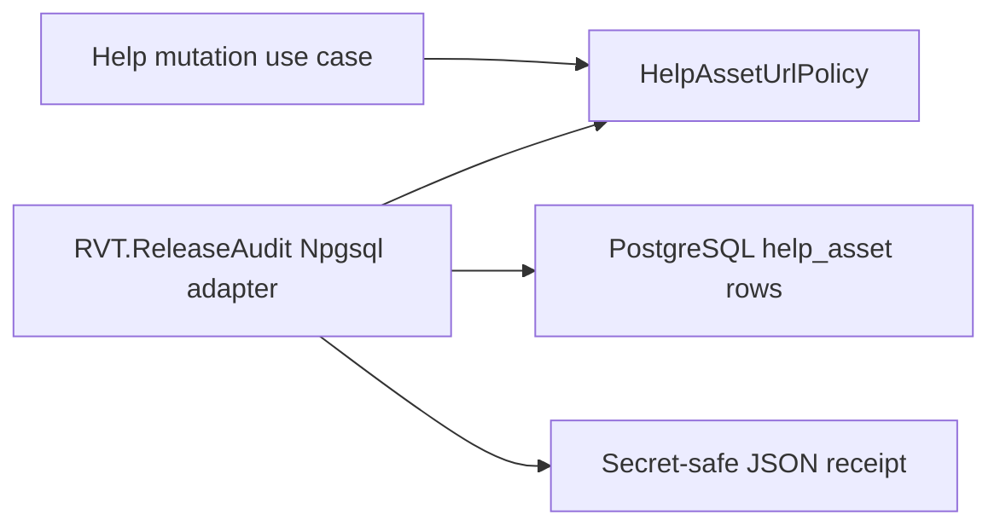

# Help Asset URL Release Audit Design

**Date:** 2026-07-28
**Status:** Approved; implementation not started
**Decision owner:** RVT Portal product owner
**Future branch:** `codex/help-asset-url-release-audit`

## Purpose

Help Admin will continue to ship, but it will remain `CONDITIONAL` until every
release database has been checked by the same .NET URL policy used by Help
mutations.

The current PostgreSQL regular expression is only a coarse diagnostic. It
cannot reproduce `System.Uri` behavior: it accepts malformed
`https://:443/guide.pdf`, while its case-sensitive scheme match rejects
`HTTPS://docs.rvt.test/guide.pdf`, which the application accepts
case-insensitively. A zero-row result from that SQL query is therefore not
release approval.

## Approved decision

Create one BCL-only `HelpAssetUrlPolicy` in `RvtPortal.Application` and make it
the sole semantic authority for both:

- canonical Help mutation URLs; and
- persisted Help asset URLs read by a dedicated, read-only .NET release audit.

Create a separate `RVT.ReleaseAudit` console adapter. It will use Npgsql to read
every `public.help_asset` row and apply the application policy without starting
the Portal host or loading unrelated infrastructure.



Dependency direction remains inward:

- `RvtPortal.Application` owns URL semantics and remains BCL-only.
- `RVT.ReleaseAudit` depends on `RvtPortal.Application` and Npgsql.
- `RvtPortal.Spa` continues to adapt HTTP mutations to the application layer.
- The application project does not depend on Npgsql, EF Core, ASP.NET Core, or
  the audit executable.

## Alternatives considered

### Dedicated release-audit adapter — approved

This keeps database transport outside the application layer, avoids Portal host
startup side effects, produces a focused deployable artifact, and reuses the
exact application policy.

### Portal-host audit subcommand — rejected

This would add fewer project files, but it would load the host's broader
configuration and infrastructure graph for a read-only release gate. That
creates unnecessary dependency and side-effect risk.

### SQL-only validation — rejected as authoritative

SQL remains useful for coarse investigation, but PostgreSQL regular expressions
cannot establish semantic parity with `System.Uri`. SQL-only evidence cannot
change Help Admin from `CONDITIONAL` to `READY`.

## Application policy

Create:

`apps/portal/RvtPortal.Application/Help/HelpAssetUrlPolicy.cs`

The policy will own:

- the 512-character persisted limit;
- required/nonblank handling;
- mutation canonicalization by trimming once before validation and persistence;
- persisted-value validation without silently trimming stored data;
- whitespace, control-character, backslash, and protocol-relative rejection;
- root-relative `/help-assets/` validation; and
- absolute HTTPS parsing, nonblank host, and no-user-info checks.

The approved interface is:

```csharp
public static class HelpAssetUrlPolicy
{
    public const int MaximumLength = 512;

    public static HelpAssetUrlValidationResult ValidateMutationValue(
        string? value);

    public static HelpAssetUrlValidationResult ValidatePersistedValue(
        string? value);
}

public sealed record HelpAssetUrlValidationResult(
    string? CanonicalValue,
    string? ViolationCode)
{
    public bool IsValid => ViolationCode is null;
}
```

`CanonicalValue` is non-null only for a valid result.
`ValidateMutationValue` returns the exact canonical value to persist.
`ValidatePersistedValue` requires the database value itself to be canonical so
legacy leading or trailing whitespace is reported rather than normalized away.

Stable violation codes are:

- `required`;
- `too_long`;
- `not_canonical`;
- `unsafe_character`;
- `unsupported_relative_path`;
- `absolute_https_required`;
- `host_required`;
- `user_info_forbidden`; and
- `malformed_uri`.

`HelpMutationValidator` will delegate its URL-specific behavior to this policy
and preserve the existing HTTP-visible field and message contract.

## Release-audit adapter

Create:

```text
apps/portal/RVT.ReleaseAudit/
├── RVT.ReleaseAudit.csproj
├── Program.cs
├── ReleaseAuditOptions.cs
└── HelpAssetUrlAudit.cs
```

Project dependencies:

- project reference to `RvtPortal.Application`;
- package reference to Npgsql;
- no reference to `RvtPortal.Spa`, `RVT.DataAccess`, or EF Core.

The executable will:

1. accept the database connection only through
   `RVT_RELEASE_AUDIT_CONNECTION`;
2. validate the environment, deployed revision, and receipt-path arguments;
3. open a repeatable-read, read-only transaction;
4. select every Help asset in stable order:

   ```sql
   SELECT id, help_article_id, url
   FROM public.help_asset
   ORDER BY help_article_id, id;
   ```

5. apply `HelpAssetUrlPolicy.ValidatePersistedValue` to every row;
6. fail closed on an incomplete read, database error, or receipt-write error;
7. write a deterministic JSON receipt; and
8. return a documented process exit code.

Approved command shape:

```bash
RVT_RELEASE_AUDIT_CONNECTION='<secret connection string>' \
dotnet run --project apps/portal/RVT.ReleaseAudit/RVT.ReleaseAudit.csproj \
  --configuration Release --no-build -- \
  help-asset-urls \
  --environment production \
  --revision '<deployed git sha>' \
  --receipt 'artifacts/release/help-asset-urls-production.json'
```

Approved exit contract:

- `0`: complete scan, zero violations, receipt written;
- `10`: complete scan, one or more violations, blocked receipt written;
- `2`: invalid or missing command input;
- `3`: database, incomplete-read, or receipt-write failure.

## Receipt and secret handling

The receipt will contain:

- environment label;
- database name;
- UTC execution time;
- deployed Git revision;
- validator/audit assembly version;
- rows scanned;
- violation count;
- pass or blocked outcome; and
- for each violation, row ID, article ID, and stable violation code.

The receipt must not contain:

- the database connection string;
- database credentials;
- raw rejected URLs; or
- user-info or other secret-like URL content.

The release principal must be read-only and limited to the connect/metadata/select
permissions required by this audit. Credentials must not be supplied through
process arguments or committed configuration.

## SQL disposition

Implementation will delete
`apps/portal/docs/release/validate-help-asset-urls.sql` and remove its
source-contract tests. The SQL regex must not remain under a renamed
policy-shaped form because that would preserve a second semantic artifact with
ongoing drift risk.

Operators may use ordinary ad-hoc SQL for investigation, but it must never
produce a `READY` decision or a release-approval receipt.

## Test strategy

### Pure policy tests

Use a shared accepted/rejected corpus covering:

- null, empty, and values longer than 512 characters;
- mutation trimming versus persisted canonical-value rejection;
- whitespace, controls, backslashes, and protocol-relative values;
- `/help-assets/` values and invalid relative values;
- non-HTTPS schemes and user-info;
- uppercase HTTPS;
- malformed `https://:443/guide.pdf`;
- IPv4, IPv6, and IDN forms supported by `System.Uri`; and
- query and fragment forms accepted by the application parser.

Tests must verify that mutation validation returns the exact value persisted.

### Shared-policy parity tests

Run the same corpus through:

- `HelpMutationValidator`; and
- `HelpAssetUrlAudit` row classification.

Neither path may duplicate URI parsing.

### Audit tests without PostgreSQL

Keep row classification and receipt construction independently testable.
Verify deterministic ordering, counts, stable violation codes, exit outcomes,
fail-closed input handling, and the absence of raw URLs and credentials.

### Opt-in PostgreSQL integration

Use the existing `RVT_TEST_POSTGRES_CONNECTION` convention with a
connection-scoped `pg_temp.help_asset` table. The row reader will accept an
internal, test-only qualified relation name; the production CLI always uses
the hard-coded `public.help_asset` relation. Insert the complete policy corpus,
exercise the same reader and classifier, confirm the transaction is read-only,
and roll it back.

This test must not use a production or release database.

## Release decision

Help Admin remains `CONDITIONAL` while any of these is true:

- the shared policy or release-audit adapter is not implemented;
- a targeted release database has no complete receipt;
- any receipt contains one or more findings; or
- the audit fails to read every row or write its receipt.

Help Admin may change to `READY` only after every targeted release database has
a complete zero-finding receipt from the deployed revision's .NET audit.

## Non-goals

This work will not:

- change the Help database schema;
- add Help asset upload or object storage;
- start the full Portal host for release validation;
- access a production/release database during implementation;
- broaden Help roles or HTTP routes;
- change unrelated Help content behavior; or
- implement the previously approved blob-client/service unification.

## Documentation and deployment changes

Implementation will update:

- `docs/release/portal/FUNCTIONALITY_READINESS_MATRIX.md`;
- `docs/development/portal/development-guidelines.md`;
- the architecture review and relevant Portal deployment/cutover guidance;
- solution/project catalogs; and
- `project_state.md`.

The audit executable will be built and published with release artifacts, then
run after schema deployment and before Help Admin is enabled.

## Pause boundary

This design is approved, but implementation has not started.

No implementation branch or worktree has been created. No project, policy,
test, SQL, workflow, or application source file has been added or modified for
the audit. No implementation plan has been authored. No production/release
database or credential has been used.

The next session must begin with:

`Read project_state.md to get up to speed`

Then review this specification before authoring the implementation plan.
